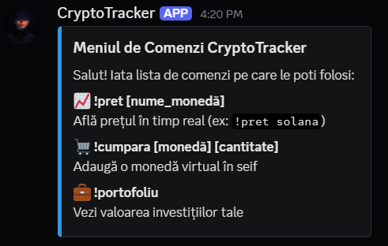
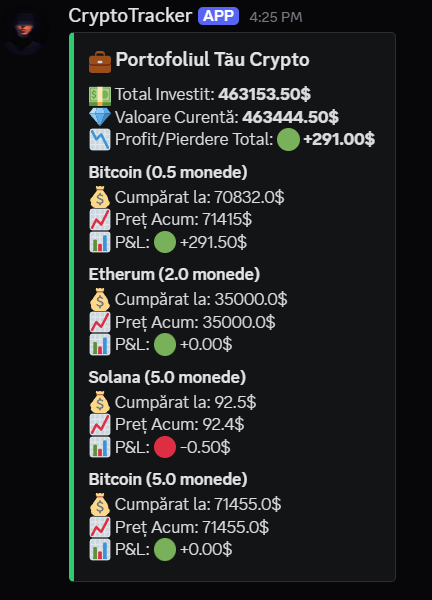
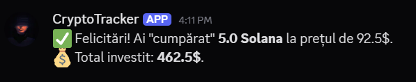

# CryptoTracker - Discord Bot

Discord bot, created in Python, which allows users to track cryptocurrency prices in real time and manage a virtual investment portfolio.

## Main Functions

* **Real-time Prices:** Fetches live financial data using the [CoinGecko API](https://www.coingecko.com/en/api).
* **Virtual Portofolio:** Users can simulate buying and selling cryptocurrencies to track their performance.
* **Data Persistance:** All transactions are securely stored in a local SQLite database.
* **Seamless UI/UX:** Elegantly formatted responses using Discord Embeds for easy tracking of profits and losses.

## Tech Used

* **Language:** Python 3.x
* **Libraries:** `discord.py` (Discord API wrapper), `requests` (API handling), `sqlite3` (Database management).
* **Architecture:** Modular code design (separation of concerns between Database, API, and Bot logic).

## Project Preview

* Command Menu Screenshot


* Crypto Portofolio Screenshot


* Transaction Screenshot

 

(The transactions are fictious, they are not possible !!!)

## Local Setup & Installation

To run this bot on your local machine, follow these steps:

1. **Clone the repository:**
    ```bash
   git clone [https://github.com/ApheliosKid/CryptoTracker.git](https://github.com/ApheliosKid/CryptoTracker.git)

2. **Install dependencies:**
    ```bash
    pip install -r requirements.txt

3. **Configure the Token:**
    * Create a new bot on the [Discord Developer Portal](https://discord.com/developers/applications).
    * Open `discord_bot.py`.
    * Replace the `TOKEN` with your unique Bot Token.

4. **Run the bot:**
    ```bash
    python discord_bot.py

## Available Commands

* `!pret [coin_name]` - Displays the current price of a cryptocurrency(e.g, !pret bitcoin).
* `!cumpara [coin_name] [amount]` - Adds a coin to your portfolio at the current market price.
* `!vinde [coin_name] [amount]` - Sells a specific amount of coin from your portfolio.
* `!portofoliu` - Display your total investment value, current balance, and overall P&L.
